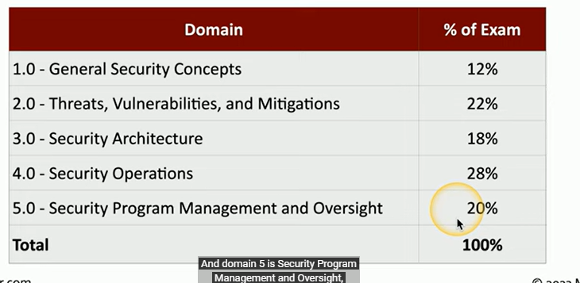
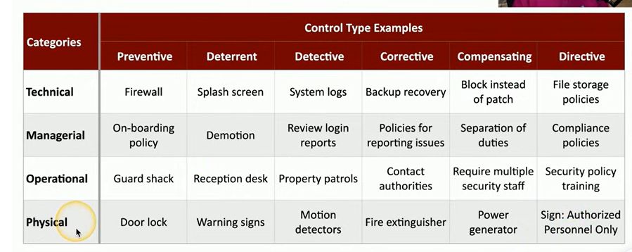

# Security+

Mostly multiple choice

Some matching, drag and drop, etc.

[https://comptiacdn.azureedge.net/webcontent/docs/default-source/exam-objectives/comptia-security-sy0-701-exam-objectives-(5-0).pdf](https://comptiacdn.azureedge.net/webcontent/docs/default-source/exam-objectives/comptia-security-sy0-701-exam-objectives-(5-0).pdf)

1.1

### Security Control Categories

1. **Technical Controls** (Logical Controls)
    - Implemented via technology to protect systems and data.
    - Examples: Firewalls, antivirus software, encryption, access control lists (ACLs).
2. **Managerial Controls** (Administrative Controls)
    - Policies, procedures, and guidelines established to manage and govern security.
    - Examples: Risk assessments, security policies, incident response plans, regular audits.
3. **Operational Controls**
    - Day-to-day controls focusing on people and processes.
    - Examples: Security awareness training, change management, configuration management.
4. **Physical Controls**
    - Measures to protect physical assets and limit access to facilities.
    - Examples: Security guards, locks, surveillance cameras, fences, climate control, CCTV (closed-circuit TV - used to monitor things happening - deterrent and detective)

---

### Control Types

1. **Preventive Controls**
    - **Purpose**: To stop incidents before they occur.
    - **Examples**: Firewalls, security policies, access controls, network segmentation.
    - **Common Categories**: Technical (e.g., firewalls), Physical (e.g., locks), Managerial (e.g., background checks).
2. **Deterrent Controls**
    - **Purpose**: To discourage malicious actions by increasing the perceived risk.
    - **Examples**: Warning signs, security guards, security policies.
    - **Common Categories**: Physical (e.g., visible surveillance cameras), Managerial (e.g., security policies).
3. **Detective Controls**
    - **Purpose**: To identify incidents or attacks that have already occurred.
    - **Examples**: Intrusion detection systems (IDS), security information and event management (SIEM) systems, audit logs.
    - **Common Categories**: Technical (e.g., IDS), Operational (e.g., security monitoring).
4. **Corrective Controls**
    - **Purpose**: To minimize damage and restore systems after an incident.
    - **Examples**: Patch management, data recovery, backups.
    - **Common Categories**: Technical (e.g., system restoration), Operational (e.g., incident response plans).
5. **Compensating Controls**
    - **Purpose**: To provide alternative protections when primary controls aren’t feasible.
    - **Examples**: Two-factor authentication in place of biometric access, strong passwords in environments without encryption.
    - **Common Categories**: Managerial (e.g., alternative access controls), Technical (e.g., multi-factor authentication).
6. **Directive Controls**
    - **Purpose**: To instruct and specify actions to be taken.
    - **Examples**: Policies, guidelines, and standard operating procedures (SOPs).
    - **Common Categories**: Managerial (e.g., compliance policies), Operational (e.g., procedural instructions).

---

### Summary Table: Categories vs. Control Types

| **Control Type** | **Technical** | **Managerial** | **Operational** | **Physical** |
| --- | --- | --- | --- | --- |
| **Preventive** | Firewalls, access controls | Background checks | Training, awareness programs | Locks, security guards |
| **Deterrent** | Security warnings on systems | Security policies | Awareness programs | Visible cameras, fencing |
| **Detective** | IDS, audit logs | Internal audits | Security monitoring | CCTV |
| **Corrective** | System patches, backups | Incident response policies | Contingency planning | Facility repairs post-incident |
| **Compensating** | Two-factor authentication | Alternative policies if primary fails | Temporary access procedures | Temporary barriers |
| **Directive** | Security configurations | Policies, compliance requirements | SOPs, training on procedures | Signs, posted guidelines |

# 1.2

### CIA Triad

1. **Confidentiality** – Ensures only authorized individuals access sensitive data.
    - Techniques: Encryption, access controls (setting ACLs to only allow access depending on credentials).
2. **Integrity** – Ensures data accuracy and consistency, preventing unauthorized modifications.
    - Techniques:
        - Hashing (you’ll be sent the data and hash of data and your system will hash it as well) — is it’s the same, it means no data has changed in transit
        - digital signatures (mathematical scheme to verify the integrity of data)
        - certificates — combined with a digital signature to verify the individual
        - Non-repudiation: provides proof that the information came from the given source
3. **Availability** – Ensures reliable access to information and systems when needed.
    - Techniques:
        - Redundant systems — so it’s always up and running
        - load balancing — to make sure servers, etc. aren’t flooded, preventing availability
        - fault tolerance — backup power
        - Patching — constantly update systems to make sure they are not prone to exploits

### Non-repudiation

- Ensures that a party cannot deny an action, often achieved with **digital signatures** and **logging**.
    - Proof of integrity: Ensuring none of the data has changed. This is done by using a hash. Sender sends the data + a hash of the data. Receiver hashes the data. If the hash matches that of the sender, it means the data is the same, and the data integrity hasn’t been compromised.
    - Proof of origin: Being able to verify the person who sent the data = authentication.
        - Digital signature: Data is signed with a private key and verified by the public key.
        - How a digital signature is created behind the scenes : When you check a box to add a digital signature with the message, a hashing algorithm makes a hash of the plaintext. Since the sender is the only one with that private key, the private key is then encrypted along with the hash of the plaintext. Attached to the message will be this digital signature. When the receiver gets the plaintext and digital signature, he will use the sender’s public key which is available to everyone to decrypt the digital signature to get a hash of the plaintext. He will perform his own hashing algorithm of the plaintext to see if the hash matches the hash that he received, which would mean that nothing was changed.
- Importance: Supports accountability and trust in digital communications.

---

### Authentication, Authorization, and Accounting (AAA Framework)

1. **Authentication** – Verifies identity — verifying that you are who you say who you say you are. 
    - People: Biometrics, passwords.
    - Systems: Certificates, tokens.
2. **Authorization** – Grants access to resources based on policies.
    - Models: Role-Based Access Control (RBAC), Attribute-Based Access Control (ABAC).
3. **Accounting** – Tracks user actions and resource access for audit — logs — login time, data sent and received, logout time. 

Steps:

1. Identification: usually username — this is who you claim to be
2. Authentication
3. Authorization
4. Accounting

How to have an additional layer of authentication when computers might not be in office and would be using a VPN: put a digitally signed signature along with the password. This could ensure that the device is really a company device. 

Certificate-based authentication:

CA: Certificate authority: it’s a device or software that’s responsible for managing all of the certificates in your environment. The organization creates a certificate for a device and that certificate could be included on a device as an authentication factor. The CA itself has a certificate that is signed by the root CA. You have to make sure that the device is digitally signed by the proper CA. 

Authorization Models: These models determine the rules and policies for allowing or restricting access to various parts of a system or network.

- How things would look without authorization models: You’d have to allocate each resource and permission to each user.  Problem: this does not scale
- Instead, you could make groups with permissions and you could add users to the group, automatically granting them all of the permissions they need without having to manually do so.

---

### Gap Analysis

- **Purpose**: Identifies differences between the current security state and desired state, revealing security gaps.
- Importance: Supports strategic planning to meet security standards and mitigate risks.
- There are some baselines that could easily be followed, such as that created by NIST / ISO.
- The baseline would include:
    - Employees — their current knowledge of cybersecurity, etc.
    - Examining the current processes — evaluating current IT systems, and existing security policies
- Analysis: Evaluating existing systems and identifying weaknesses along  with the most effective processes. You then break everything down into smaller pieces so you can evaluate how every objective is scored. You then make the final comparison and the path needed to get to the desired security goal. At this point, you could make a gap analysis report.

---

### Zero Trust Model

Zero trust — you have to authenticate and prove yourself every time you try to access a network. Nothing is trusted and everything must bed verified. MFA, encryption, firewalls, etc. are put in place in order to create a zero trust environment. 

How to implement zero trust in out network: Split the network into separate planes of operation: 

- Data plane: used to move data from one network to the other.
    - Process the frames, packets, and network data
    - Processing, forwarding, trunking, encrypting, NAT
1. **Control Plane** – Manages the actions of the data plane and policies to enforce Zero Trust principles.
    - **Adaptive Identity**: Continuously verifies identity, adapting to context and risk. Checking the source location (why does it say China for ex) and the requested resource, relationship to organization, type of connection, etc.
    - **Threat Scope Reduction**: Decrease the number of possible entry points. Limits access scope, reducing attack surface.
    - **Policy-Driven Access Control**: It examines all of the data points listed above and decides which authentication process should be used in order to ensure that the person trying to identify himself is who he says he is. Enforces context-based access rules.
    - **Policy Administrator**: Sets and manages security policies.
    - **Policy Engine**: Makes access decisions based on policies and conditions.
    - Determines how packets should be forwarded: Routing tables, session tables, NAT tables
2. **Data Plane** – Performs the actual security process.  Deals with m moving data from one network to another. Implements policies to enforce Zero Trust in data flows.
- **Implicit Trust Zones**: Avoids assumption of trust based on network location.
- **Subject/System**: Represents users or devices.
- **Policy Enforcement Point**: Any subjects and systems will be subject to this. Enforces policy decisions directly on data flow. It’s like a gatekeeper — all the data passes through it and it gathers all of the information on it with regards to the data’s trustworthiness.
    
    Security zones: Where you are coming from and where you are going. You can make separate zones within your organization for different VPN connections and separate groups within your organization. you could now set rules on what zone has access to all of the other zones. You  could label zones as trused and untrusted and traffic will be denied based off of that. 
    
    
    

---

### Physical Security

1. **Bollards** – Physical barriers protecting entry points from vehicles.
2. **Access Control Vestibule (Mantrap)** – Controlled entry points for high-security areas. It’s a room you must pass through in order to get access to the rest of the building. Goal is to allow or prevent access to a particular area until you authenticate a person. 
3. **Fencing** – Physical boundaries to deter unauthorized access. It’s usually visible and hard to cut down. 
4. **Video Surveillance** – Monitors activity, assists in deterrence and investigation. 
    1. Ex: CCTV (closed circuit television) = camera. It can recognize motion and objects and identify faces. There could be a whole network of cameras. 
5. **Security Guard** – Monitors, responds, and controls physical access. He makes sure that. Usually security guards work in groups of 2 to make sure there are checks and balances, so no one single person has access to a physical asset. 
6. **Access Badge** – Physical tokens for entry to secure areas. It could have your picture, name, and other details and must be worn at all times. 
7. **Lighting** – Enhances visibility, discourages unauthorized activity. Since attackers usually avoid the light. Nothing is more secure than having a well-lit area if you want to deter an unauthorized attacker from entering an area 
8. **Sensors** – Detect environmental changes.
    - **Infrared**: Detects body heat — infrared radiation in both light and dark. This is common in motion detectors.
    - **Pressure**: Detects weight/pressure changes. Floor and window sensors.
    - **Microwave**: Detects motion through microwave signals — used for a much larger area so it’s even more efficient than infrared.
    - **Ultrasonic**: Detects motion via sound waves, which can be used for detecting motion or collisions.

---

### Deception and Disruption Technology

1. **Honeypot** – Decoy system designed to attract attackers, isolating malicious activity. The attacker is generally a machine. You want to make the honeypot realistic to keep the attacker there for as long as possible. 
2. **Honeynet** – Network of honeypots simulating a larger environment. This creates a much more believable environment. 
3. **Honeyfile** – Decoy file containing fake data to detect unauthorized access. Ex: a file called passwords.txt, but it’s fake. If the file is accessed, you could have alerts fired. 
4. **Honeytoken** – Fake data or credentials placed within systems to detect misuse. If that data is copied or distributed, you’ll know exactly where it came from. Ex: fake API credentials or a list of fake email addresses. You can then monitor to see if those credentials appeared anywhere in the internet. 

### Module 1.3: Change Management Processes and Their Impact on Security

### 1. Importance of Change Management Processes

- Ensures systematic approach to changes in IT systems, applications, and business processes.
- Helps maintain security posture by minimizing risks associated with changes.
- Facilitates compliance with regulatory requirements and internal policies.
- Enhances accountability and transparency within the organization.

### 2. Business Processes Impacting Security Operations

- **Approval Process**
    - Required sign-offs for changes to ensure alignment with security policies.
    - Reduces the risk of unauthorized changes.
- **Ownership: the owner is the one managing the process and not the one making the changes. Rather, he reviews and tests the result to see if it’s good.**
    - Designates individuals responsible for specific changes, enhancing accountability.
    - Ensures that all changes are documented and tracked.
- **Stakeholders: the people who will be impacted by the change. They would probably want updates on the changes that will occur and the breadth of the change.**
    - Identification of all parties affected by the change (e.g., IT staff, end-users, management).
    - Involvement of stakeholders in discussions to address security concerns.
- **Impact Analysis — every change has an impact on an organization so you have to determine a risk value of that change.**
    - Evaluation of how changes will affect existing systems, security measures, and business operations.
    - Assessment of potential security risks introduced by changes. And the opposite, assessment of what the risk would be if you would not make the change
- **Test Results**
    - Documentation of outcomes from testing changes in a controlled environment before full deployment. Ex: using a sandbox testing environment where it has no connection to actual production where you could test out changes you make.
    - Validation of security measures and functionality to ensure minimal disruption.
- **Backout Plan: having a plan where you could revert changes before the change occurred.**
    - Contingency plan to revert changes if issues arise post-deployment.
    - Essential for maintaining security and operational continuity.
    - Before you make a change to a system, make sure you have a whole backup of the system.
- **Maintenance Window**
    - Scheduled times for implementing changes to minimize impact on users. Ex: not during workday when everyone is using the application, but rather, at night, when less people are using the system. The time of the year also matters, since some times could be busier than others.
    - Helps in planning security measures during updates or system modifications.
- **Standard Operating Procedure (SOP)**
    - Formalized procedures for implementing changes, ensuring consistent application of security measures.
    - Guides staff on protocols for managing changes securely.

### 3. Technical Implications of Change Management

- **Allow Lists/Deny Lists**
    - Management of permissions to control what applications or users can access systems, enhancing security.
- **Restricted Activities**
    - Definition of actions that are not allowed to protect the system’s integrity (e.g., unauthorized installations).
- **Downtime**
    - Scheduled or unexpected downtime impacts availability; planning around this minimizes security risks. Everyone being affected should be informed that downtime will occur.
- **Service Restart**
    - Procedures for safely restarting services to ensure security protocols are enforced post-change. Security changes could only occur once you reboot a system or specific service.
- **Application Restart**
    - Guidelines for restarting applications after updates, ensuring secure configurations are applied.
- **Legacy Applications**
    - Special considerations for older systems that may not support current security measures; need for additional protections.
    - They’re often no longer supported by the developer. You should generally not mess with this, since there won’t be too many people who would be able to fix it if you mess it up.
- **Dependencies**
    - Understanding relationships between applications and systems; changes in one can affect others, necessitating careful management to avoid security vulnerabilities.

### 4. Documentation in Change Management

- **Updating Diagrams**
    - Ensures network and system architecture diagrams reflect changes for accurate understanding of the environment.
- **Updating Policies/Procedures**
    - Revision of security policies and operational procedures to align with new configurations and technologies.

### 5. Version Control

- Management of software versions and updates to track changes and revert to previous versions if necessary.
- Essential for ensuring that only authorized changes are deployed, maintaining system integrity.

### Module 1.4: Importance of Using Appropriate Cryptographic Solutions

### 1. Public Key Infrastructure (PKI)

- **Public Key**: Used to encrypt data or verify digital signatures in asymmetric encryption.
- **Private Key**: Confidential key used to decrypt data or create digital signatures.
- **Key Escrow**: Secure storage of encryption keys by a third party for potential recovery, supporting continuity in case of lost keys.

### 2. Encryption

- **Levels of Encryption**:
    - **Full-Disk Encryption**: Encrypts entire drives to protect data at rest.
    - **Partition Encryption**: Encrypts specific disk partitions, allowing partial protection of data.
    - **File Encryption**: Encrypts individual files, suitable for securing sensitive documents.
    - **Volume Encryption**: Encrypts logical volumes, offering flexible protection across systems.
    - **Database Encryption**: Protects sensitive data within databases, supporting data integrity and confidentiality.
    - **Record Encryption**: Encrypts specific database records, allowing granular data security.
- **Transport/Communication Encryption**:
    - Protects data in transit using protocols like TLS/SSL to secure internet communications.
- **Encryption Types**:
    - **Asymmetric**: Uses public-private key pairs (e.g., RSA) for secure key exchange and digital signatures.
    - **Symmetric**: Uses the same key for encryption and decryption, suitable for high-speed encryption.
- **Key Exchange**:
    - Process of securely sharing encryption keys, crucial for symmetric encryption.
- **Algorithms**:
    - Includes commonly used cryptographic algorithms (e.g., AES, RSA, ECC) chosen based on security requirements.
- **Key Length**:
    - Longer key lengths generally offer more security; however, they require more processing power.

key stretching or key strengthening: perform the encryption process multiple times on a single type of data. This means if someone wanted to brute force some data that’s been encrypted multiple times using this key stretching method, that they would need to decrypt multiple times to see if their brute force was successful. And this adds an additional overhead, and certainly would create more time during the brute force process.

### 3. Cryptographic Tools

- **Trusted Platform Module (TPM)**: Hardware-based encryption chip for secure storage of encryption keys.
- **Hardware Security Module (HSM)**: Physical device that manages and protects encryption keys for higher security.
- **Key Management System**: Centralized system for generating, storing, and managing encryption keys.
- **Secure Enclave**: Isolated processor space on a device for storing and processing sensitive data.

### 4. Obfuscation:

Definition: Making something that is normally easy to understand difficult to understand. Information is hidden in plain sight, 

- **Steganography**: Hides data within files (e.g., images) to obscure its presence.
- **Tokenization**: Replaces sensitive data with tokens, reducing exposure of original data.
- **Data Masking**: Obscures data (e.g., with symbols) to protect it while allowing limited visibility.

### 5. Hashing

- Converts data into fixed-length hash values to protect integrity.
- Common algorithms: SHA-256, MD5 (though MD5 is no longer recommended due to vulnerabilities).

### 6. Salting

- Adds random data (salt) to passwords before hashing to prevent brute-force and rainbow table attacks.

### 7. Digital Signatures

- Verifies data authenticity and integrity using public-private key pairs, providing non-repudiation.

### 8. Key Stretching

- Enhances weak passwords by applying additional cryptographic processing, such as PBKDF2 or bcrypt.

### 9. Blockchain

- **Open Public Ledger**: Decentralized ledger technology for transparent and secure record-keeping.

### 10. Certificates

- **Certificate Authorities (CAs)**: Trusted entities issuing digital certificates for identity verification.
- **Certificate Revocation Lists (CRLs)**: Lists of revoked certificates, ensuring expired or compromised certificates aren’t trusted.
- **Online Certificate Status Protocol (OCSP)**: Real-time status verification for certificates.
- **Self-Signed Certificates**: Certificates created and signed by the owner, useful internally but less trusted.
- **Third-Party Certificates**: Certificates issued by external CAs, widely accepted for external security.
- **Root of Trust**: The foundational entity in a certificate chain that verifies all subsequent certificates.
- **Certificate Signing Request (CSR) Generation**: Process of requesting certificate issuance from a CA.
- **Wildcard Certificates**: Single certificate that secures multiple subdomains of a domain.